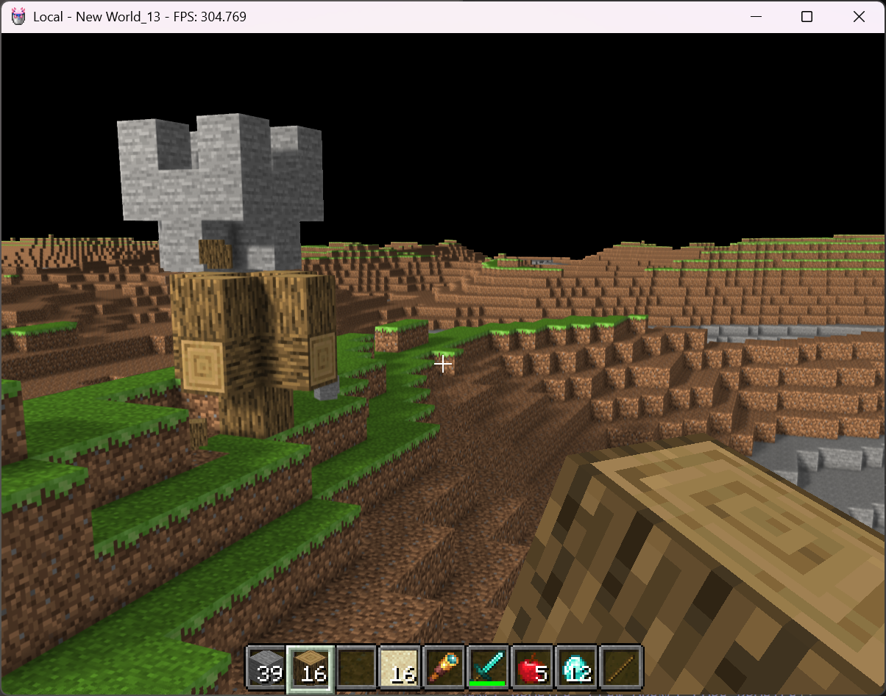
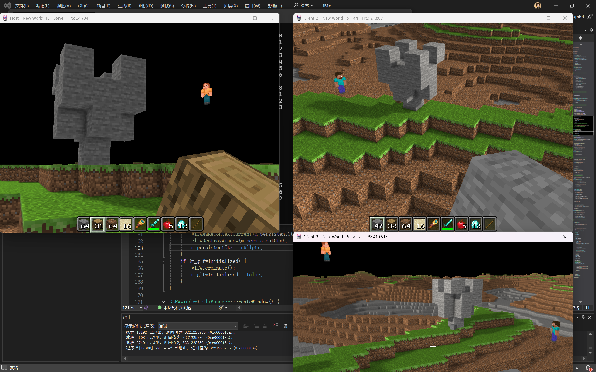
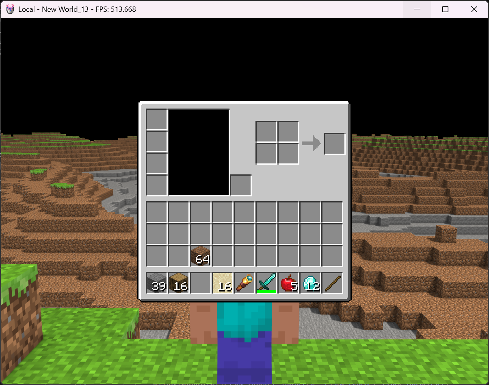

# iMc - 基于OpenGL的体素渲染引擎

## 简介

iMc 是一个使用现代OpenGL技术实现的体素渲染引擎，灵感来源于Minecraft。该项目展示了实时图形学中的多种高级渲染技术，包括地形生成、实例化渲染、动态区块管理、环境光遮蔽（SSAO）以及高性能软阴影（PCSS+VSSM）。引擎支持第一人称漫游、方块放置/破坏、物品栏系统等交互功能。

## 效果图

以下为引擎运行效果截图：





## 主要技术

### 🎯 核心技术亮点

- **地形生成**：通过柏林噪声及多层噪声叠加，生成自然起伏的地形
- **高性能渲染**：结合可见面剔除、实例化渲染，大幅减少drawcall次数，实现160fps高帧率运行
- **动态区块管理**：采用动态加载、卸载区块及视锥剔除技术，减少60%方块渲染数量
- **环境光遮蔽**：使用SSAO（屏幕空间环境光遮蔽）技术，增强场景深度感和真实感
- **模型与动画**：通过Assimp库实现3D模型及骨骼动画加载，为生物系统奠定基础
- **全局光照阴影**：采用PCSS+VSSM（百分比渐进软阴影+方差阴影映射）技术，实现高性能的软阴影效果

### ⚙️ 渲染管线优化

- **实例化渲染**：对大量相同几何体进行批量绘制，显著提升渲染效率
- **视锥剔除**：仅渲染摄像机可见范围内的区块，减少不必要的GPU负载
- **可见面剔除**：通过背面剔除和遮挡剔除，进一步优化渲染性能
- **动态LOD**：根据距离调整渲染细节，平衡画质与性能

## 外部库

项目依赖以下第三方库：

- **GLFW** - 窗口创建与输入处理
- **GLEW** - OpenGL扩展加载
- **OpenGL** - 图形渲染API
- **GLM** - OpenGL数学库（向量、矩阵运算）
- **Assimp** - 3D模型导入库（支持多种格式）
- **libjson** - JSON解析库（用于配置读取）
- **stb_image** - 图像加载库（轻量级PNG/JPG加载）

### DLL依赖（Windows）

- `glew32.dll` / `glew32d.dll` (Debug版)
- `assimp-vc143-mt.dll` / `assimp-vc143-mtd.dll` (Debug版)
- 其他系统库由Visual Studio自动链接

## 构建与运行

### 环境要求

- Windows 10/11
- Visual Studio 2022（或支持C++17的编译器）
- OpenGL 3.3+兼容的显卡

### 构建步骤

1. 克隆仓库到本地
2. 使用Visual Studio打开 `iMc.sln` 解决方案文件
3. 配置项目属性（包含目录、库目录已预设于PropertySheet_debug.props）
4. 编译运行

### 运行说明

程序启动后进入第一人称视角，默认为普通移动模式。

| 按键 | 普通模式 | 观察者模式 |
|------|---------|-----------|
| `WASD` | 移动（有惯性） | 移动（即停） |
| `鼠标` | 控制视角 | 控制视角 |
| `空格` | 跳跃 | 上升 |
| `Ctrl` | 下蹲（移速降低，不可跳跃） | 下降 |
| `W` 双击 | 进入奔跑（松开W/撞墙/下蹲退出） | - |
| `Q` / `E` | - | 减少/增加速度倍率 |
| `TAB` | 切换至观察者模式 | 切换至普通模式 |
| `鼠标左键` | 破坏方块 | 破坏方块 |
| `鼠标右键` | 放置方块 | 放置方块 |
| `滚轮` | 切换物品栏选中项 | 切换物品栏选中项 |
| `1-0` | 选择物品栏槽位 | 选择物品栏槽位 |
| `G` | 切换天气 | 切换天气 |
| `ESC` | 退出程序 | 退出程序 |

## 项目结构

```
iMc/
├── scr/                    # 源代码
│   ├── core.h             # 核心定义
│   ├── iMc.cpp            # 主程序入口
│   ├── Camera.h/cpp       # 摄像机系统
│   ├── World.h            # 世界基类
│   ├── World_4.h/cpp      # 主世界实现
│   ├── render/            # 渲染系统
│   ├── generate/          # 地形生成
│   ├── chunk/             # 区块管理
│   └── collision/         # 碰撞检测
├── shader/                # GLSL着色器
├── assert/                # 资源文件
│   ├── textures/          # 纹理贴图
│   └── models/            # 3D模型
├── show/                  # 效果图
└── bin/                   # 运行时依赖库
```

## 未来计划

- [ ] 添加更多方块类型和材质
- [ ] 实现完整的生物系统（NPC、怪物）
- [ ] 集成物理引擎（碰撞、重力）
- [ ] 支持多光源和动态天气系统
- [ ] 优化内存管理和资源加载


