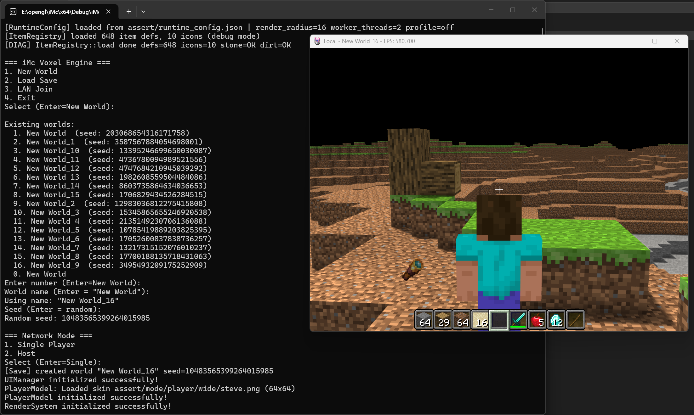
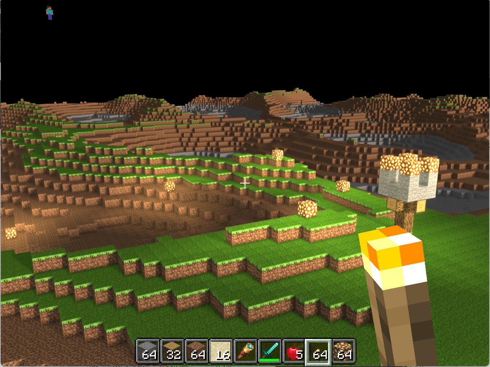

# iMc - 基于 OpenGL 的体素渲染引擎

## 简介

iMc 是一个使用现代 OpenGL（4.6 core profile）和 C++17 实现的体素渲染引擎，灵感来源于 Minecraft。项目展示了实时图形学中的多种高级渲染技术——延迟渲染、SSAO、PCSS+VSSM 软阴影、昼夜动态光照，并配套一套高吞吐的多线程区块管线、GPU 实例化批量绘制、增量显存更新等性能工程实践。除了第一人称漫游、方块放置/破坏、物品栏等基础交互外，引擎还实现了**世界存档**与**局域网联机**两大系统。

## 效果图

以下为引擎运行效果截图：





## 主要特性

### 🎨 渲染

- **延迟渲染管线**：G-Buffer → HBAO → CSM 阴影 → 延迟光照 → 正向合成，多 pass 解耦光照与几何复杂度
- **环境光遮蔽（HBAO）**：地平线角环境光遮蔽 + 蓝噪声 + 时域累积（TAA），增强场景深度与体积感，昼夜淡出
- **高性能软阴影**：PCSS + VSSM（百分比渐进软阴影 + 方差阴影映射）+ CSM（级联阴影映射，最多 4 级），近实硬、远柔和，TAA 时域降噪
- **最终画面 TAA**：时域抗锯齿，抖动投影 + 历史帧混合，同时平滑 HBAO 噪声与阴影半影
- **昼夜动态光照**：太阳沿天空运动，光照强度与色温随时间平滑过渡（冷白 ↔ 暖橙），可切换天气与时间速度
- **体素洪水填充块光照**：多光源 BFS 传播，支持透明方块衰减（水/树叶），RGBA8 曼哈顿距离缓存，增量精确更新，GPU SSBO 采样
- **模型与骨骼动画**：通过 Assimp 加载 3D 模型与玩家骨骼动画，支持第三人称视角和多皮肤
- **Dear ImGui 调试面板**：F1 开合，实时调整手持物品 TRS、查看性能指标，改值即时生效

### ⚡ 性能

- **GPU 实例化批量绘制**：所有可见 section 通过单次 `glMultiDrawElementsIndirect` 提交，极大压缩 draw call
- **8 字节紧凑实例数据**：每个可见面仅 8 字节，世界坐标在着色器内由 `gl_DrawID` 重建，省带宽省显存
- **多线程区块管线**：地形生成 / 网格构建 / 光照 BFS 分三阶段下放到 worker 线程池，主线程只做轻量集成
- **增量显存更新**：单次改方块只把变化的面 patch 进 VBO（`glMapBufferRange` + `UNSYNCHRONIZED`），不重传整块；光照同理只上传脏 section
- **逐 section 剔除**：视锥剔除 + 距离剔除 + 纵向剔除，只渲染真正可见的 section
- **着色器二进制缓存**：编译结果按源码路径 FNV-1a 哈希缓存到磁盘，后续启动跳过编译链接直接灌入
- **动态加载 / 卸载 / 显存驱逐**：区块随玩家移动按 Chebyshev 环加载，远处释放 GPU slot 与内存

### 🗺️ 玩法与系统

- **第一人称 / 第三人称**：三段速移动（行走 / 奔跑 / 下蹲）+ 双击冲刺 + 观察者模式，AABB 碰撞物理
- **方块交互**：射线拾取放置 / 破坏，轴向感知方块（如原木）按朝向放置，物品栏热键
- **体素光照**：萤石和火把等光源经洪水填充传播，透明方块（水/树叶）加速光衰减，改方块实时增量更新，GPU 端高效采样
- **物品系统**：数据/行为分离的物品资产，方块物品渲染成真立方体（背包图标 / 掉落物 / 手持），掉落物邻近同类自动堆叠并按数量显示厚度，背包「光标携带」拖拽（长按脱离、拖出界面丢弃），手持物品复用手臂挥手动画、支持自定义 OBJ 模型（如望远镜）
- **世界存档**：Minecraft Anvil 风格的 region 文件（`.mca`）+ LZ4 压缩，自动保存玩家位置与已修改区块
- **局域网联机**：基于 ENet 的 Host / Join 架构，多人位置同步 + 服务端权威区块同步

## 存档系统

世界数据按 Minecraft Anvil 格式持久化到磁盘：

```
saves/
└── <世界名>/
    ├── world.json              # 世界元数据（种子、玩家位置/朝向、上次游玩时间）
    └── region/
        ├── r.0.0.mca           # 一个 region 容纳 32×32 = 1024 个 chunk
        ├── r.0.-1.mca
        └── ...
```

- 每个 chunk 内的方块数据按 section 用 **LZ4** 压缩，全空气 section 不占空间
- 区块按需读盘：生成新区块时先查存档，命中则直接加载，否则才地形生成
- **自动保存**：默认每 60 秒保存一次已修改区块（可在配置中调整或关闭），区块卸载时也会落盘
- 退出时自动保存玩家位置与所有脏区块

## 局域网联机

基于 **ENet**（UDP）的客户端-服务端架构，适合同一局域网内多人游玩：

- **房主（Host）**：持有世界存档，是数据权威端；负责向客户端推送地形、转发玩家状态
- **客户端（Join）**：不落盘，从服务端获取世界种子和区块数据；视距内缺区块时主动请求
- **玩家同步**：每个玩家的位置 / 朝向通过不可靠通道高频同步，其他玩家以带皮肤的模型渲染
- **区块同步**：新玩家加入时全量推送周边地形（按距离排序），之后增量推送 + 按需响应；区块数据 LZ4 压缩传输
- ENet 强制 IPv4（规避部分 Windows 上 IPv6bind 失败问题）

## 物品系统

物品采用**数据 / 行为分离**设计（类 UE5 DataAsset）：`ItemDefinition`（静态数据，`assert/item_registry.json` 驱动）+ `ItemStack`（每格运行时内容）+ 无状态 `Item` 行为对象。

- **方块物品立方体**：方块类物品在背包、掉落物、手持三处都渲染成真正的 3D 立方体（逐面纹理与地形同源）。背包图标由离屏 FBO 等距渲染成小纹理缓存；缺纹理的方块自动退回 2D 挤出图标。
- **掉落物堆叠**：地上的同种掉落物会相互吸引聚拢并合并（上限为该物品的最大堆叠数），并按数量叠出可见厚度。
- **背包拖拽（光标携带）**：打开背包（`E`）后，**长按**某格约 0.18 秒会把该格物品**脱离**到鼠标光标上（源格清空，可继续吸附掉落物）；光标图标随鼠标移动并显示数量；释放时落到目标格（放下 / 合并 / 交换），或**拖出背包面板外释放即丢弃**到世界。关闭背包时光标上的物品会尽量放回背包，放不下则丢出。
- **手持动画**：手持物品时隐藏手臂本身，物品复用手臂的挥手动画；破坏方块（长按左键）时持续挥动。
- **自定义模型**：物品可声明 `model_type: custom_model` + `model_path` 使用外部 OBJ 模型（如望远镜 spyglass），复用 3D 模型着色器渲染。

> 添加新物品图标后，运行 `python tools/gen_item_registry.py` 重新生成注册表（合并式，保留手工编辑）。调试模式下只加载少量标记 `load_in_debug` 的物品图标，避免启动时加载全量 600+ 张。

## 外部库

| 库 | 用途 |
|---|---|
| **GLFW** | 窗口创建与输入处理 |
| **GLEW** | OpenGL 扩展加载 |
| **OpenGL** | 图形渲染 API（4.6 core） |
| **GLM** | 数学库（向量、矩阵） |
| **Assimp** | 3D 模型 / 骨骼动画导入 |
| **jsoncpp** | JSON 配置解析（0.5.0 老版 API） |
| **stb_image** | 图像加载（随源码内置） |
| **ENet** | UDP 网络传输（随源码内置，header-only） |
| **LZ4** | 区块数据压缩（随源码内置） |
| **EnTT** | ECS 框架，粒子系统用（随源码内置） |

### DLL 依赖（Windows）

- `glew32.dll` / `glew32d.dll`（Debug）
- `assimp-vc143-mt.dll` / `assimp-vc143-mtd.dll`（Debug）
- 预生成步骤会自动从 `bin/debug/` 或 `bin/release/` 拷贝到输出目录

## 构建与运行

### 环境要求

- Windows 10 / 11
- Visual Studio 2022（C++17）
- 支持 **OpenGL 4.6 core** 的显卡（依赖 `gl_DrawID`、`glMultiDrawElementsIndirect`、SSBO）

### 构建步骤

1. 克隆仓库到本地
2. 用 Visual Studio 2022 打开 `iMc.sln`
3. 选择 x64 Debug 或 Release（include / lib 路径已在 PropertySheet 中预设，外部库默认位于 `D:\library\`）
4. 编译并运行

### 启动方式

直接运行可执行文件会进入命令行菜单：

```
=== iMc Voxel Engine ===
1. New World      新建世界（输入世界名 + 种子，种子可为文字）
2. Load Save      加载存档（从已有世界列表选择）
3. LAN Join       加入局域网房间（输入 服务器IP:端口）
4. Exit
```

新建 / 加载世界后会询问网络模式：**Single Player**（单机）或 **Host**（开房，需指定端口）。

也可用命令行参数跳过菜单直接启动（便于多开联机调试）：

```bash
iMc.exe --host 60011                  # 以端口 60011 开房
iMc.exe --join 127.0.0.1 60011        # 加入本机 60011 端口的房间
iMc.exe --world MyWorld                # 直接快速开始指定世界
iMc.exe --winpos 100 100              # 指定窗口初始位置
```

命令行默认端口为 **60011**。

### 操作说明

程序启动后进入第一人称视角，默认普通移动模式。

| 按键 | 普通模式 | 观察者模式 |
|------|---------|-----------|
| `WASD` | 移动（有惯性） | 移动（即停） |
| `鼠标` | 控制视角 | 控制视角 |
| `空格` | 跳跃 | 上升 |
| `Ctrl` | 下蹲（移速降低，不可跳跃） | 下降 |
| `W` 双击 | 进入奔跑（松开 W / 撞墙 / 下蹲退出） | - |
| `Q` / `E` | - | 减少 / 增加速度倍率 |
| `TAB` | 切换至观察者模式 | 切换至普通模式 |
| `鼠标左键` | 破坏方块 | 破坏方块 |
| `鼠标右键` | 放置方块 | 放置方块 |
| `滚轮` | 切换物品栏选中项 | 切换物品栏选中项 |
| `1-0` | 选择物品栏槽位 | 选择物品栏槽位 |
| `E` | 开合背包面板 | - |
| `F` | 丢弃当前选中格一个物品 | 丢弃当前选中格一个物品 |
| `F3` | 切换第一 / 第三人称 | 切换第一 / 第三人称 |
| `F1` | 开合 ImGui 调试面板 | 开合 ImGui 调试面板 |
| `G` | 切换天气 | 切换天气 |
| `O` / `P` | 减 / 增时间流速 | 减 / 增时间流速 |
| `ESC` | 退出当前世界（返回菜单） | 退出当前世界 |

## 运行时配置

无需重新编译即可调参——编辑 `assert/runtime_config.json`（保存后自动热重载，即刻生效，无需重启）：

| 字段 | 默认 | 说明 |
|---|---|---|
| `render_radius` | 16 | 渲染半径（chunk），加载 (2r+1)² 个 chunk |
| `vertical_cull_ratio` | 0.5 | 下方 section 剔除比例 |
| `worker_threads` | 2 | 区块 worker 线程数（0 = 自动） |
| `max_inflight_requests` | 32 | 同时在途的最大区块构建任务数 |
| `max_uploads_per_frame` | 16 | 每帧最多上传到 GPU 的脏 section 数 |
| `auto_save_interval_sec` | 60 | 自动保存间隔（秒），0 = 禁用定时保存 |
| `print_profile_every_second` | false | 每秒打印性能分析汇总 |
| `verbose_texture_loading` | false | 输出纹理加载详情 |
| `verbose_shader_loading` | false | 输出着色器编译详情 |
| `light_budget` | 1.25 | 总光照预算（整体亮度旋钮） |
| `ambient_day` | 0.55 | 白天环境光占比（背阳面底光） |
| `ambient_night` | 0.40 | 夜晚环境光占比 |
| `sun_strength` | 0.70 | 阳光直射功率 |
| `time_scale` | 0.4 | 昼夜速度（1 现实秒 = 多少游戏小时） |
| `force_recompile_shaders` | true | 强制重编译着色器（忽略磁盘缓存） |
| `debug_mode` | true | 调试模式（物品图标按需加载，加速启动） |

## 项目结构

```
iMc/
├── scr/                       # 源代码
│   ├── iMc.cpp                # 程序入口（独显标志 + ENet 实现 + CliManager）
│   ├── CliManager.h/.cpp      # 会话/菜单管理、窗口创建、持久 GL 上下文
│   ├── World.h/.cpp           # 顶层世界：主循环、子系统编排、输入分发
│   ├── Player.h/.cpp          # 玩家：相机、物理、移动、交互、物品栏、光标携带栈
│   ├── Item.h/.cpp            # 物品行为基类 + BlockItem 等（放置/使用逻辑）
│   ├── Camera.h/.cpp          # 摄像机
│   ├── core.h / Data.h        # 全局常量 / 顶点等数据
│   ├── RuntimeConfig.h/.cpp   # 运行时配置（读 runtime_config.json）
│   ├── Profiler.h/.cpp        # CPU 性能分析器
│   ├── chunk/                 # 区块系统（ChunkManager / Chunk / Section / Arena / WorkerPool / BlockType）
│   ├── render/                # 延迟渲染管线（RenderSystem / BlockOutlineRenderer）
│   ├── net/                   # 局域网联机（NetManager / Transport / Message / ChunkSync / Player / Object）
│   ├── save/                  # 世界存档（ChunkSaveManager / RegionFile）
│   ├── generate/              # 地形生成（Noise / TerrainGenerator）
│   ├── light/                 # 体素光照（LightSource / LightCache / LightPropagation）
│   ├── collision/             # 碰撞检测（AABB / Ray / PhysicsConstants）
│   ├── particle/              # 粒子系统（GPU / ECS）
│   ├── mode/                  # 模型与玩家动画（Model / PlayerModel / PlayerAnimator / SkinManager）
│   ├── item/                  # 物品系统（ItemDefinition / ItemStack / ItemRegistry / ItemFactory / ItemModel / BlockItemModel）
│   ├── entity/                # 掉落物实体（DroppedItem / DroppedItemManager）
│   ├── UI/                    # UI（UIManager / UIHotbar / UIInventory / UISlot / UINumber）
│   ├── imgui/                 # Dear ImGui（第三方，即时模式 GUI，调试面板用）
│   ├── enet/                  # ENet（第三方，header-only）
│   └── entt/                  # EnTT ECS（第三方，header-only）
├── shader/                    # GLSL 着色器（g_buffer / hbao / shadow / deferred_lighting / item / block_item / …）
├── assert/                    # 资源
│   ├── textures/              # 纹理贴图（textures_config.json 配置）
│   ├── mode/                  # 模型与皮肤
│   ├── minecraft/             # 物品图标等资源
│   ├── item_registry.json     # 物品注册表
│   └── runtime_config.json    # 运行时参数
├── tools/                     # 辅助脚本（gen_item_registry.py 生成物品注册表）
├── saves/                     # 世界存档（运行时生成）
├── show/                      # 效果图
└── bin/                       # 运行时 DLL
```

## 技术架构概览

更详细的架构说明（区块两阶段管线、GPU arena、增量上传、网络协议、存档格式、线程模型、关键不变量等）见 [CLAUDE.md](CLAUDE.md)。

简要来说：

- **区块三阶段管线**：worker 先生成纯方块数据（Task 1），待自身和 4 个邻居方块数据齐备后，再由 worker 一次性构建含跨区块边界的完整网格（Task 2），待自身和 8 个 Moore 邻居全部 loaded 后由 worker 做 9 区块完整光照 BFS（Task 3）。主线程仅按帧配额集成结果，避免卡顿尖峰。
- **GPU 实例 arena**：size-class 分配器管理一个大 VBO，每 section 占一个 slot；改方块走增量 patch，区块远离则驱逐 slot。光照用独立 SSBO（binding=2 光照数据 + binding=3 section 查找表），脏 section 精确跟踪增量上传。
- **渲染**：每帧 `ChunkManager::update` 先于 `RenderSystem::render`——这是增量上传安全的承重前提。

## 许可与说明

本项目为学习/演示性质的图形与引擎实践，代码注释与提交信息均为简体中文。
